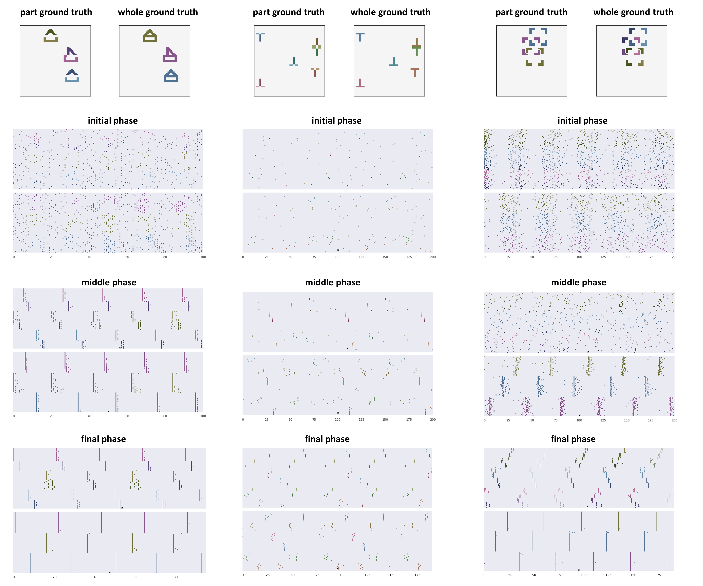

# Representing part-whole hierarchy with coordinated synchrony in neural networks

## 1. Introduction

 Human vision flexibly extracts the part-whole hierarchy from a visual scene. However, representing the parsing tree in a real neural network is difficult because it is not clear how to dynamically allocate neurons to represent the node in a tree structure. This paper presents a new theory to represent the part-whole hierarchy by the hierarchical neuronal synchrony structure. Neurons are dynamically synchronized into groups to temporarily represents the tree nodes. Further, the coordinated temporal relationship among neuronal groups represents the tree structure. A two-level hybrid model inspired by the visual cortical circuit is provided to dynamically create the synchrony-encoded parsing tree during the active perception of the scene. The synchrony state is gradually created by the top-down prediction / bottom-up integration between levels and inside each level. Four synthetic datasets to explicitly test the capability of creating parsing trees are developed. The quantitative and qualitative results show that the brain-inspired model is able to parse a range of scenes of different complexities through dynamically formed synchrony structure. It is promising that the paper shed lights on developing human-like vision in neural network models.

The example video of parsing process (on each dataset) is as follows (each subplot shows the evolution of the variables in the right figure):

[https://github.com/codingbugmonster/part_whole_hierarchy/assets/106099997/b4b5d916-05fe-439c-9562-d4d8d33081e1](https://github.com/codingbugmonster/part_whole_hierarchy/assets/134407088/23d0cc97-d78c-49d5-a8f1-0f3ed0c51d4c)

<video src=".//images//SHOPs.mp4"></video>

[https://github.com/codingbugmonster/part_whole_hierarchy/assets/106099997/ec8a2d13-575f-4490-9cac-b7c7d14f4f19](https://github.com/codingbugmonster/part_whole_hierarchy/assets/134407088/76ae6d0a-e83b-4b7e-8c48-4edf5379f44c
)

<video src=".//images//Squares.mp4"></video>

[https://github.com/codingbugmonster/part_whole_hierarchy/assets/106099997/16ec9749-5399-4a7b-9984-e1d68507850d](https://github.com/codingbugmonster/part_whole_hierarchy/assets/134407088/559f1088-fe7d-4599-8140-d043c8540901
)


<video src=".//images//Ts.mp4"></video>

[https://github.com/codingbugmonster/part_whole_hierarchy/assets/106099997/e490cc5f-40ea-463e-92b1-99ab30dc4d9c](https://github.com/codingbugmonster/part_whole_hierarchy/assets/134407088/1d9cb068-9ae9-4631-a237-1aab3f10cbf1
)

<video src=".//images//Double-MNIST.mp4"></video>

## 2. Code

### 2.1 Environment

The following packages should be installed before running this project:

```
pytorch
matplotlib
seaborn
h5py
numpy
sklearn
notebook
copy
time
```

### 2.2 Code interpretation

#### 2.2.1 get network

The trained network can be downloaded from:

https://drive.google.com/file/d/17mp5BPLcDNAoTfQi5z-fsohE8lX8gP3a/view?usp=sharing

After download, make sure that the files are unziped into ./tmp_net directory

#### 2.2.2 get dataset

Dataset can be downloaded from:

https://drive.google.com/file/d/1-K9wln8XPjzNAMDnJS403NLFmprmBkhX/view?usp=sharing

After download, make sure that the files are unziped into ./tmp_data directory

#### 2.2.3 run simulation

By running: run_simulation.ipynb, you can reproduce most of the figure in the paper (examples shown below). Besides, you can generate the animation of the whole dataflow like above.


